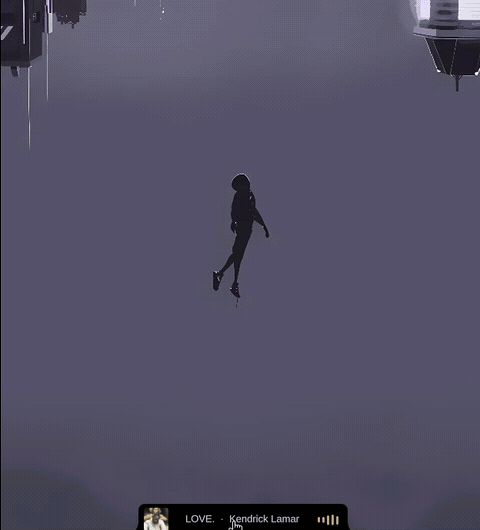
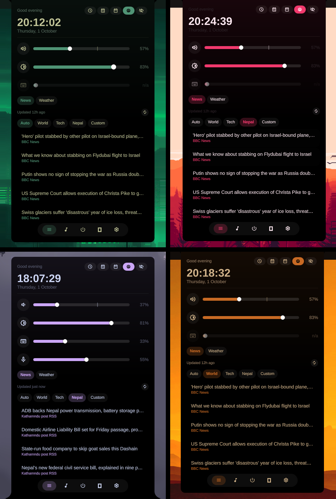
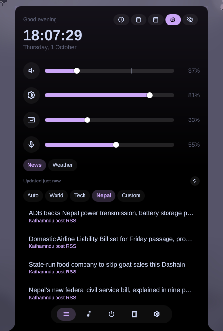
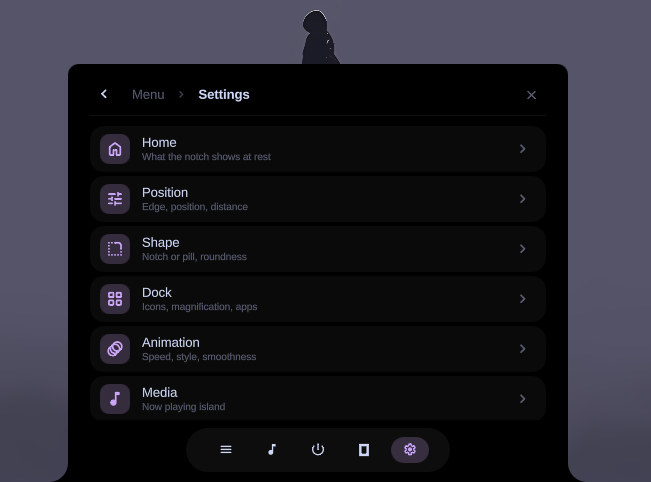
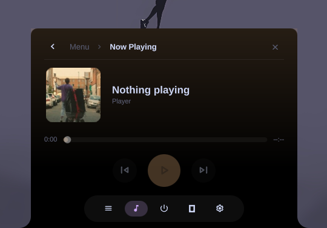
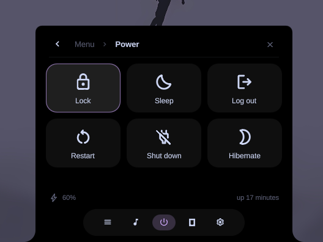
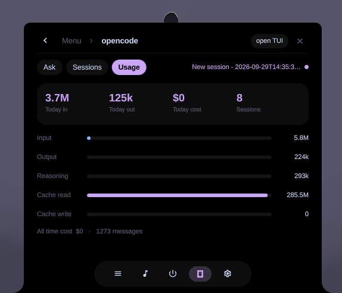

# Notch Island

An edge-anchored notch / pill for [Omarchy](https://omarchy.app). It rests as a dock or a
clock hub, becomes a media island while music plays, and opens into volume, brightness,
Now Playing, opencode, power and settings.

| | |
|---|---|
|  |  |
|  |  |


## Demo



<sub>Or download <a href="demo.mp4">demo.mp4</a> (1.4 MB).</sub>

## Theme aware

The notch follows your Omarchy theme. Text and accent come from the active
`colors.toml`, and a standalone instance reloads on every theme switch, so nothing
stays stuck on the palette that happened to be active at startup.




| | | |
|---|---|---|
  |  | |
| **The clock hub** - clock, battery, news, weather, notes | **Settings** - eight pages, live previews | **Media** - left right looks| 
|  |  |  |
| **Now Playing** - cover, marquee, live equaliser | **Power** - lock, sleep, log out, restart, shutdown, hibernate | **opencode** - ask, sessions, token usage, cost |

## Features

- **Rests as a dock or a clock hub.** The hub carries the clock, date, battery,
  headlines, weather and quick notes. Open on hover or click.
- **Becomes a media island** while music plays: cover art, title marquee and a live
  equaliser. Click through to full Now Playing.
- **Four edges, two shapes.** Top, bottom, left or right. Notch (flush) or pill
  (floating), with roundness, ear curve, width, height and distance all adjustable.
- **Theme aware.** Accent, foreground and background follow the active Omarchy theme,
  live.
- **Settings without a config file.** Eight pages, with live previews of whichever
  resting module and dock you have selected.
- **opencode built in.** Ask (`opencode run`), recent sessions, token usage and cost
  read from opencode's own sqlite DB, plus a banner when the agent notifies you.
- **System controls in the notch.** Volume, brightness, keyboard backlight and mic
  level, plus a power menu.
- **Dock with magnification.** Pinned and running apps, running dots, hover lift and
  configurable icon size, spacing and padding.
- **Live-reloaded settings.** Edit `~/.config/omarchy/notch-island.json` by hand and it
  applies immediately, no restart.

Deliberately not included: other notifications, wallpapers, keybinding search, emojis,
an app launcher, or a clipboard.

## Usage

| Where | Action | Result |
|---|---|---|
| Dock slot | left / middle / right click | focus or launch / new window / pin-unpin |
| Resting shell | hover or click | open the dock or clock hub |
| Media island | click / middle / wheel / right | player / play-pause / next-prev / menu |
| Breadcrumbs | click | jump back up the stack |
| Any popup | Esc, click outside | close |

Everything is also reachable over IPC, which is what you bind to keys:

```bash
scripts/ipc.sh toggle              # open / close the hub
scripts/ipc.sh show player         # Now Playing
scripts/ipc.sh show settings
scripts/ipc.sh setEdge left        # move to another edge
scripts/ipc.sh setRest clock       # rest on the dock or the clock
scripts/ipc.sh nudge 40            # shift along the edge
scripts/ipc.sh state               # dump current state as JSON
```

Bind it to a Hyprland key, for example:

```
bind = SUPER, N, exec, ~/.config/omarchy/plugins/paudelsamir.notch-island/scripts/ipc.sh toggle
```

## Install

```bash
omarchy plugin add https://github.com/paudelsamir/notch-island.git --enable
```

## Configure

Right-click the resting island, or pick **Settings** in the menu, to open its own
settings window: position and edge, shape, dock slots, animation, click behavior,
media, and opencode. Settings are the island's own
(`~/.config/omarchy/notch-island.json`), independent of `~/.config/omarchy/shell.json`,
and are written live.

From a keybind or a terminal:

```bash
scripts/ipc.sh show settings
```

> **Running it as a standalone overlay.** The notch is easiest to keep out of the bar
> slot, because `omarchy.bar` holds exactly one bar. To do that, point a private
> quickshell config at the plugin instead of loading it in the shell:
>
> ```bash
> mkdir -p ~/.config/quickshell/notch-island
> ln -sfn ~/.config/omarchy/plugins/paudelsamir.notch-island ~/.config/quickshell/notch-island/NotchIsland
> ln -sfn /usr/share/omarchy/shell/Commons ~/.config/quickshell/notch-island/Commons
> ```
>
> Then write `shell.qml` next to them, with `Window { visible: false }` as the root
> (a bare `Item` root makes Quickshell open an opaque white window), containing
> `NotchIslandPlugin.Notch { anchors.fill: parent }`. Run it under systemd:
>
> ```ini
> # ~/.config/systemd/user/quickshell-notch-island.service
> [Service]
> ExecStart=/usr/bin/quickshell -p %h/.config/quickshell/notch-island
> Restart=on-failure
> ```
>
> ```bash
> systemctl --user enable --now quickshell-notch-island
> ```
>
> Run it standalone and it needs `omarchy-theme-set` to notify it, or it will keep the
> palette it loaded at startup. The theme reload in `Notch.qml` handles this.

Requirements: `opencode` and `brightnessctl` on `PATH` for those two features, and
`sqlite3` for reading opencode's database. Set `OPENCODE_DB` to point at a non-default
database path.

## Remove

```bash
omarchy plugin remove paudelsamir.notch-island
```

Your settings stay at `~/.config/omarchy/notch-island.json`; delete that too for a clean
slate. If you ran it standalone, also drop the service and the config:

```bash
systemctl --user disable --now quickshell-notch-island
rm -rf ~/.config/quickshell/notch-island
```

Working on a clone instead? `./scripts/install.sh` copies the folder into
`~/.config/omarchy/plugins/user.notch-island`, and `./scripts/uninstall.sh` removes it
again.

---

MIT licensed. See [LICENSE](LICENSE).
